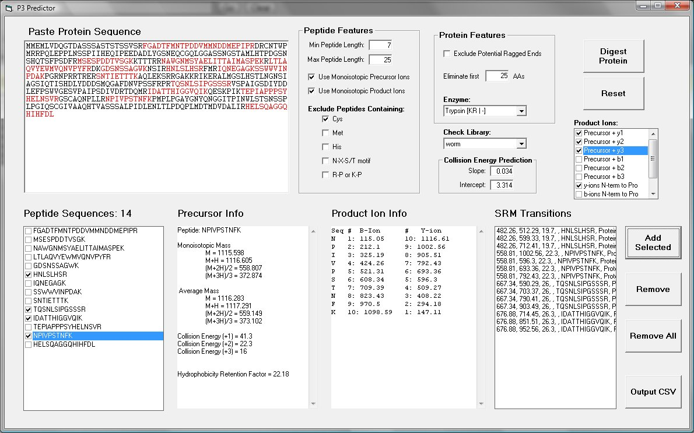

# P3 - Proteotypic Peptide Predictor

Written by Michael J. MacCoss, Department of Genome Sciences, University of Washington

## Overview

P3 was written to simplify the selection of precursor > product ion transitions for peptides to be measured by selected reaction monitoring (SRM).



## Usage

**Input:** Type or paste a protein sequence.

**Output:** The output file is a comma separated values (CSV) file that can be uploaded into the SRM transition table of Xcalibur for the TSQ Quantum.

**Note:** Cysteines are always assumed to be reduced and alkylated with iodoacetamide.

## Installation

### Installing richtx32.ocx

This program requires the `richtx32.ocx` ActiveX control. If you encounter errors about this file being missing, follow the steps below.

#### Step 1: Copy richtx32.ocx to the correct folder

If `richtx32.ocx` isn't already on your system, download it from [MajorGeeks](https://www.majorgeeks.com/).

Copy `richtx32.ocx` to the correct folder based on your Windows version:

| Windows Version | Destination Folder |
|-----------------|-------------------|
| Windows 7, 10 & 11 (32-Bit) | `C:\Windows\System32` |
| Windows 7, 10 & 11 (64-Bit) | `C:\Windows\SysWOW64` |

> **Note:** We received errors when copying and pasting in some cases, so we recommend you drag and drop `richtx32.ocx` to the correct folder.

Check if your problem is solved now. If not, proceed to Step 2.

#### Step 2: Register richtx32.ocx

If you already have `richtx32.ocx` on your computer or downloading the file didn't resolve the issue, try registering `richtx32.ocx`.

1. Open the **Command Prompt as Administrator**. Do not use Windows Terminal or PowerShell.

2. Type in the following command for your operating system:

   - **Windows 7, 10 & 11 (32-Bit):**
     ```
     regsvr32.exe %systemroot%\system32\RICHTX32.OCX
     ```

   - **Windows 7, 10 & 11 (64-Bit):**
     ```
     regsvr32.exe %systemroot%\syswow64\RICHTX32.OCX
     ```

3. You will see a message when completed:
   > "DllRegisterServer in C:\FilePath\RICHTX32.OCX succeeded."

---

## Links

- [MacCoss Lab](http://proteome.gs.washington.edu/)
- [Department of Genome Sciences](http://www.gs.washington.edu/)
- [University of Washington](http://www.washington.edu/)

## License

This project is licensed under the MIT License - see the [LICENSE](LICENSE) file for details.
